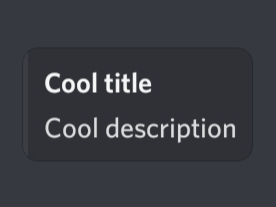

# DiscordEmbed-PHP
Easily create an object for discord embed.

Inspired by Discord.js MessageEmbed.

Released: **3/18/21**

Updated: **---**


> *If you want to just easily send a message to discord, then take a look at my [DiscordWebhook-PHP](https://github.com/renzbobz/DiscordWebhook-PHP) :D*


## Getting started

### Installation
Download the DiscordEmbed.php file and then require it to your project and you're ready to go!

### Usage
Create new instance and set your desired values.
```php
$embed = (new DiscordEmbed)
  ->setTitle("Cool title")
  ->setDescription("Cool description");

echo $embed->toJSON();
echo $embed; // same as above
# {"title":"Cool title","description":"Cool description"}
```
Send to discord.
```php
$ch = curl_init($webhook);
curl_setopt_array($ch, [
  CURLOPT_POST => true,
  CURLOPT_POSTFIELDS => json_encode([
    "embeds" => [
      $embed->toArray()
    ]
  ]),
  CURLOPT_RETURNTRANSFER => true,
  CURLOPT_HTTPHEADER => ["Content-type: application/json"]
]);
$res = curl_exec($ch);
curl_close($ch);
print_r($res);
```


Field array
```php 
$fieldArray = [
  $name,
  $value,
  $inline, # default: false
  $index # optional
];
```

#### Add fields
```php 
->addField($name, $value, $inline, $index);
->addFields(
  $fieldArray,
  $fieldArray,
  ...
);
```
$index is where you want to insert the field.

#### Remove or insert fields using spliceFields
```php 
# Remove

## Remove one field from index 1
->spliceFields(1, 1);
//             ^  ^
//   start index  delete count

## Remove two fields starting from index 1
->spliceFields(1, 2);
// so field from index 1 and 2 has been removed

# Insert

## Insert fields starting from index 1
->spliceFields(1, 0, 
  $fieldArray,
  ...
);
```

## Features
### Url
Every url is path ready so it means that you can just pass the file path and it resolves to complete url.

Example:
```php
->setAuthor("Cool name", "author.php", "images/author-icon.png");
# https://yourwebsite.com/author.php
# https://yourwebsite.com/images/author-icon.png
->setThumbnail("../thumbnail.png");
# https://yourwebsite.com/thumbnail.png
```
### Color
Color can accept both hex and rgb.
```php 
->setColor("ffffff");
->setColor("#ffffff");
->setColor("255,255,255");
```
or as if you want random.
```php 
->setColor("RANDOM");
```


## Methods
### Title
```php
->setTitle($title);
->appendTitle($title);
->prependTitle($title);
```
### Description
```php
->setDescription($description);
->appendDescription($description);
->prependDescription($description);
```
### Url
Automatically sets the url of your website if **$url** is empty.
```php
->setURL($url);
```
### Color 
Can accept both hex and rgb.

Hex: $color = "#ffffff" or "ffffff";

Rgb: $color = "255,255,255";

or random: $color = "RANDOM";
```php 
->setColor($color);
```
### Timestamp
Automatically sets the current timestamp if **$timestamp** is empty.
```php 
->setTimestamp($timestamp);
```
### Author
Automatically sets the url of your website if **$url** is empty otherwise pass a false to **$url** if you don't want to automatically set it.

***$url** and **$icon** are optional.*
```php 
->setAuthor($name, $url, $icon);
```
### Thumbnail
***$height** and **$width** are optional.*
```php 
->setThumbnail($url, $height, $width);
```
### Image
***$height** and **$width** are optional.*
```php 
->setImage($url, $height, $width);
```
### Footer
***$icon** is optional.*
```php 
->setFooter($text, $icon);
```
### Fields
***$inline** and **$index** are optional.*

*Splice field's **$fields** is optional unless you want to insert some fields.*
```php 
->addField($name, $value, $inline, $index);
->addFields(...$fields);
->spliceFields($startIndex, $deleteCount, ...$fields);
```
### To Array
```php
->toArray();
```
### To JSON
```php
->toJSON();
```
